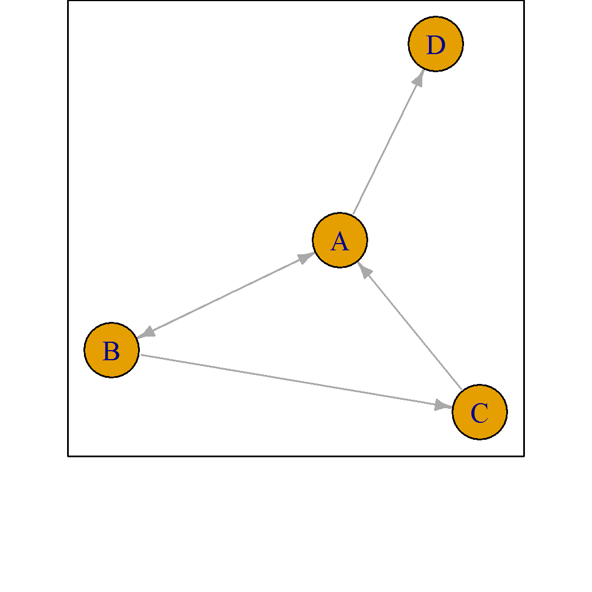
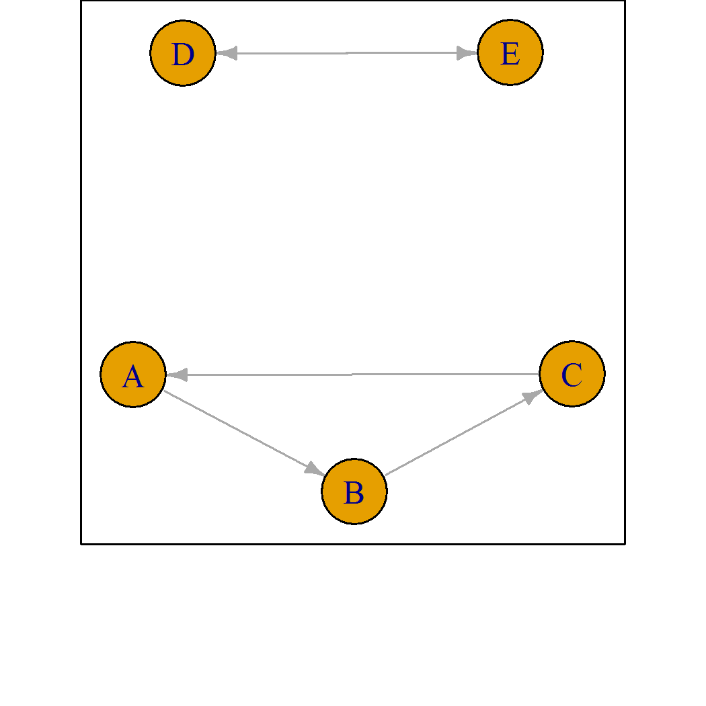
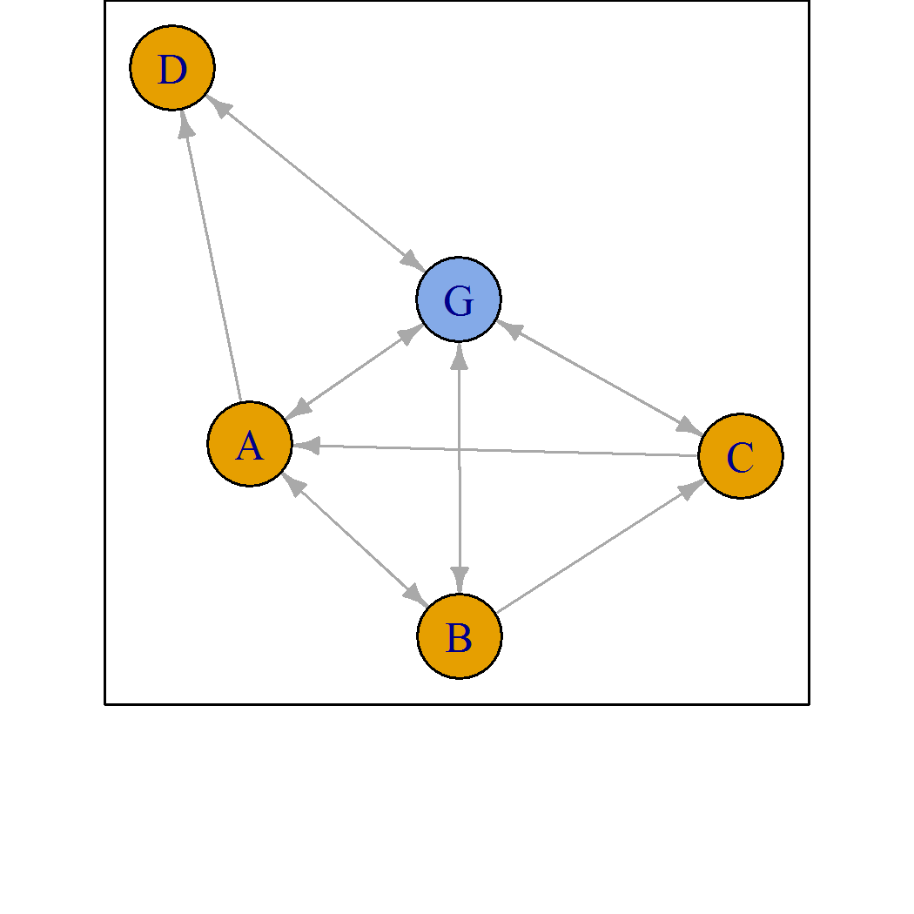

---

# Modelling Item Worth Based on Rankings

<center>
<span style = "font-size: 0.9em">
<b>Heather Turner</b>, Freelance/University of Warwick, UK<br>
Jacob van Etten, Bioversity International, Costa Rica<br>
David Firth, University of Warwick/Alan Turing Institute, UK<br>
Ioannis Kosmidis,University of Warwick/Alan Turing Institute, UK<br><br>

<b>May 15 2018</b>
</span>
</center>


---

## Rankings

Rankings arise in a number of settings

 - Finishing order in a set of races
 - Consumer preferences in market research
 
What is the worth of each item?

---

## Luce's Axiom

> Probability of choosing item A over item B unaffected by other items 

Suppose we have a set of `$J$` items

`$$S = \{i_1, i_2, \ldots, i_J\}$$`

Then under Luce's axiom

`$$P(j | S) = \frac{\alpha_{j}}{\sum_{i \in S} \alpha_i}$$`

where `$\alpha_i$` represents the **worth** of item `$i$`.

---

## Plackett-Luce Model

Consider a ranking of `$J$` items as a sequence of choices.

The *Plackett-Luce* model is then

`$$P(i_1 \succ \ldots \succ i_J) = \prod_{j=1}^J\frac{\alpha_{i_j}}{\sum_{i \in A_j} \alpha_i}$$`

where `$A_j$` is the set of alternatives in choice `$j$`.

**PlackettLuce** can be used to fit this model.

---

## Example 1: Netflix Data

Netflix released movie rankings for the Netflix Prize.

Using `read.soc` from **PlackettLuce**, we read in a set of 
rankings for 4 movies


```r
library(PlackettLuce)
preflib <- "http://www.preflib.org/data/election/"
netflix <- read.soc(file.path(preflib,
                              "netflix/ED-00004-00000138.soc"))
head(netflix, 2)
```

```r
#    n Rank 1 Rank 2 Rank 3 Rank 4
# 1 68      2      1      4      3
# 2 53      1      2      4      3
```

---

## Convert to Rankings

**PlackettLuce** requires the rankings to give the rank per item 
vs. item per rank.

We convert the rankings using `as.rankings`, which creates a 
special data structure


```r
R <- as.rankings(netflix[,-1], input = "ordering")
colnames(R) <- attr(netflix, "item")
print(R[1:3], width = 60)
```

```r
#                                                              1 
# "Beverly Hills Cop > Mean Girls > Mission: Impossible II  ..." 
#                                                              2 
# "Mean Girls > Beverly Hills Cop > Mission: Impossible II  ..." 
#                                                              3 
# "Beverly Hills Cop > Mean Girls > The Mummy Returns > Mis ..."
```

---

## Fit Plackett-Luce Model

Now `PlackettLuce` can be used to fit the model, with frequencies 
as weights


```r
mod <- PlackettLuce(R, weights = netflix$n)
coef(mod, log = FALSE)
```

```r
#             Mean Girls      Beverly Hills Cop      The Mummy Returns 
#              0.2306285              0.4510655              0.1684719 
# Mission: Impossible II 
#              0.1498342
```

These coefficients are the *worth* parameters and represent the 
probability that each movie is ranked first.

---

## Inference

For inference it is better to work on the log scale. Comparison intervals can be computed via `qvcalc`.


```r
qv <- qvcalc(mod)
plot(qv, ylab = "Worth (log)", main = NULL)
```

 \

---

## Ranking properties

The Netflix rankings are an example of *strict*, *complete*
rankings.

In other applications we might have

 * tied ranks
 * incomplete rankings
     - *sub-rankings*: only some items ranked each time
     - *top-n*: only the top `$n$` items are ranked
     
**PlackettLuce** implements a generalized model which handles 
ties and sub-rankings.

---

## Generalized Model

Now consider a ranking of sets `$C_1 \succ C_2 \succ \ldots \succ C_J$`.

The generalized model with ties up to order `$D$` is

`$$
\prod_{j = 1}^J \frac{f(C_j)}{
\sum_{k = 1}^{\min(D_j, D)} \sum_{S \in {A_j \choose k}} f(S)}
$$`

where

`$$f(S) = \delta_{|S|} \left(\prod_{i \in S} \alpha_i \right)^\frac{1}{|S|}$$`

---

## Ranking Networks

In some cases, the underlying network of wins and losses means 
the worth cannot be estimated by maximum likelihood.

<div class="left">

 \

</div>

<div class="right">

 \

</div>

---

## Pseudo-rankings

**PlackettLuce** connects the network by adding `npseudo` 
*pseudo-rankings* with a ghost item.

<div class="left">
<ul>
<li>The MLE is always estimable</li>
<li>Can be viewed as a Bayesian prior</li>
<li>Default `nspeudo = 0.5`</li>
</ul>
</div>

<div class="right">

 \

</div>

---

## Heterogeneity

The worth of items may vary with the ranking conditions, e.g. 
judge making the ranking.

**PlackettLuce** works with **partykit** to fit *Plackett-Luce trees*

1. Fit Plackett-Luce to all the data.
2. Test stability of worth parameters w.r.t. each covariate.
3. If significant instability, split data by relevant covariate.
4. Repeat 1-3 until no significant instability/split makes 
sub-group too small.

---

## Example 2: Beans

A citizen science trial of bean varieties in Nicaragua:

 - 11 bean varieties 
 - Each farmer grew 3 varieties
     - Asked which was best and which was worst
     - Asked to compare each to variety to local variety
 - Covariates on growing conditions, including
     - Growing season (Primera, Postrera, Apante)
     - Year
     - Maximum night-time temperature
     
---

## Example 2: Beans

The example on `?beans` tidies the original data

```r
example("beans", package = "PlackettLuce", echo = FALSE)
```

The original `beans` data frame has 842 rows: one per farm.

The 3-way and 2-way rankings are collated in a rankings object


```r
R[1,]
```

```r
# [1] "PM2 Don Rey > SJC 730-79 > BRT 103-182"
```

```r
R[3368,]
```

```r
# [1] "Local > SJC 730-79"
```

---

## Plackett-Luce Tree

The rankings are grouped by farm


```r
G <- grouped_rankings(R, rep(1:nrow(beans), 4))
format(head(G, 2), width = 50)
```

```r
#                                                                   1 
#  "PM2 Don Rey > SJC 730-79 > BRT 103-182, Local > BRT 103-182, ..." 
#                                                                   2 
# "INTA Centro Sur > INTA Sequia > INTA Rojo, Local > INTA Rojo, ..."
```

Use `pltree` with max depth 3 and `$\ge$` 5% records in each group


```r
beans$year <- factor(beans$year)
tree <- pltree(G ~ ., data = beans[c("season", "year", "maxTN")],
               minsize = 0.05*n, maxdepth = 3)
```

---

## Plotting Tree


---

## Summary

Future work

 - Incorporating spatial effects
 - Incorporating genotype information
 
More details

 - **PlackettLuce** is on CRAN and GitHub
 - Full details of the methods and further examples in the vignette
